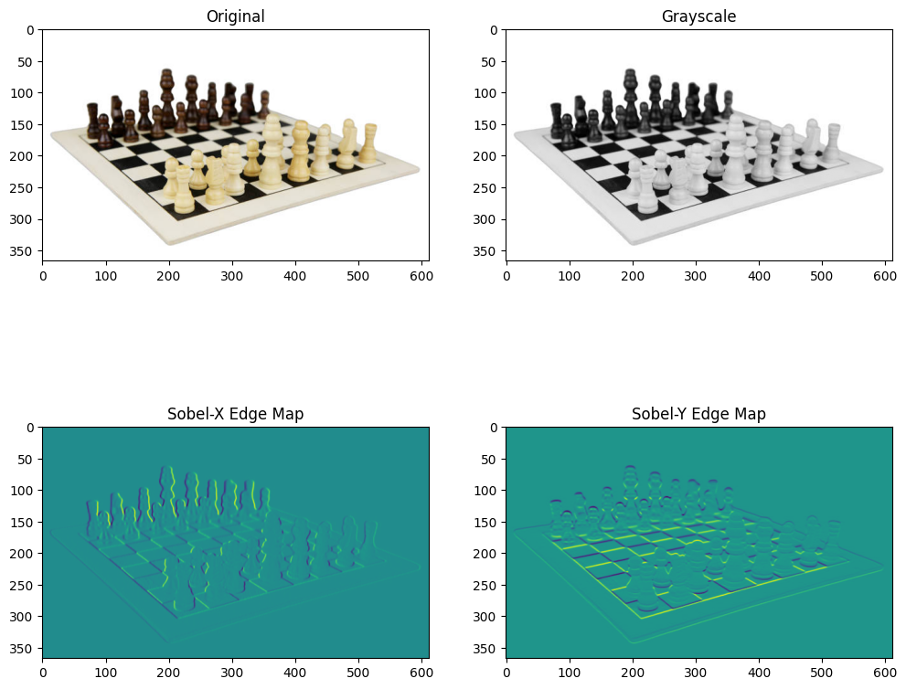
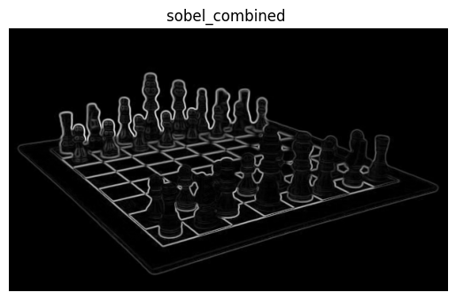
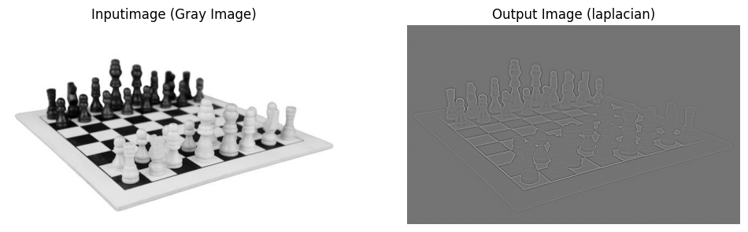

# EDGE-DETECTION
## Aim:
To perform edge detection using Sobel, Laplacian, and Canny edge detectors.

## Software Required:
Anaconda - Python 3.7

## Algorithm:
### Step1:
Import all the necessary modules for the program.

### Step2:
Load a image using imread() from cv2 module.

### Step3:
Convert the image to grayscale

### Step4:
Using Sobel operator from cv2,detect the edges of the image.

### Step5:

Using Laplacian operator from cv2,detect the edges of the image and Using Canny operator from cv2,detect the edges of the image.

## Program

```python

# Developed By : HARIHARAN J
# Reg No : 212223240047

import cv2
import numpy as np
import matplotlib.pyplot as plt

# Load the image
image = cv2.imread('Chess.jpg') 

# Convert the image to grayscale
gray_image = cv2.cvtColor(image, cv2.COLOR_BGR2GRAY)

# Apply Sobel operator

sobelx  = cv2.Sobel(src = gray_image, ddepth = cv2.CV_64F, dx = 1, dy = 0, ksize = 3) 
sobely  = cv2.Sobel(src = gray_image, ddepth = cv2.CV_64F, dx = 0, dy = 1, ksize = 3)

sobelx = cv2.Sobel(gray_image, cv2.CV_64F, 1, 0, ksize=3)  # Sobel X
sobely = cv2.Sobel(gray_image, cv2.CV_64F, 0, 1, ksize=3)  # Sobel Y
sobel_combined = cv2.magnitude(sobelx, sobely) 


plt.figure(figsize = (12, 16))
plt.subplot(321); plt.axis('on'); plt.imshow(image[:,:,::-1]); plt.title('Original')
plt.subplot(322); plt.axis('on'); plt.imshow(gray_image, cmap='gray');plt.title('Grayscale') 
plt.subplot(323); plt.axis('on'); plt.imshow(sobelx);plt.title('Sobel-X Edge Map')
plt.subplot(324); plt.axis('on'); plt.imshow(sobely);plt.title('Sobel-Y Edge Map');


plt.axis('off'); plt.imshow(sobel_combined, cmap='gray' ); plt.title('sobel_combined ');


## LAPLACIAN EDGE DETECTOR

# Convert the image to grayscale
gray_image = cv2.cvtColor(image, cv2.COLOR_BGR2GRAY)

# Apply Laplacian operator
laplacian = cv2.Laplacian(gray_image, cv2.CV_64F)


plt.figure(figsize = (12, 16))
plt.subplot(121); plt.axis('off'); plt.imshow(gray_image, cmap='gray'); plt.title('Inputimage (Gray Image)')

plt.subplot(122);plt.imshow(laplacian, cmap='gray');plt.axis('off'); plt.title('Output Image (laplacian)');

 
## CANNY EDGE DETECTOR

## Canny Edge Detection (simple example with no texture or noise)


img = cv2.imread('SEC.jpg')

# Convert to grayscale.
img_gray = cv2.cvtColor(img, cv2.COLOR_BGR2GRAY)

edges = cv2.Canny(img_gray, threshold1 = 180, threshold2 = 200)

plt.figure(figsize = (10,7))
plt.subplot(221); plt.axis("off"); plt.imshow(img[:,:,::-1]); plt.title('Original') 
plt.subplot(222); plt.axis("off"); plt.imshow(img_gray, cmap='gray');      plt.title('Grayscale') 


plt.axis("off"); plt.imshow(edges,cmap='gray');plt.title('Canny Edge Map');

```

## Output:

### SOBEL EDGE DETECTOR



### SOBEL COMBINED




### LAPLACIAN EDGE DETECTOR



### CANNY EDGE DETECTOR


## Result:
Thus the edges are detected using Sobel, Laplacian, and Canny edge detectors.